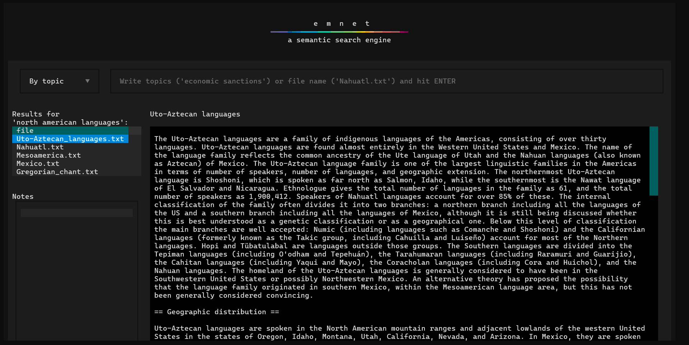

# emnet

A semantic search engine for local text files, made with Textual.

-----

## Table of Contents

- [Installation](#installation)
- [Usage](#usage)
- [License](#license)

## Installation
Simply install the main `emnet` folder (containing all project files, not `src/emnet`):
```console
pip install emnet/
```
If you don't wish to install the program, you can simply either:
- copy and paste the text files you want to search inside the `src/emnet` directory
- save a copy of `emnet.py`, `utils.py` and `emnet.tcss` in the directory you wish
to work with. 

In this case, change the import statement in `emnet.py` from
```
import emnet.utils as utils
```
to
```
import utils
```

## Usage
To run emnet, all you have to do is open the terminal in the directory you wish to work with and call:
```
emnet
```
The first time the program runs, it will automatically create a folder called `emnet` within 
the working directory, containing a `database.pkl` and an `index.pkl` file. On subsequent 
runs, if it detects new files present, it will ask if you want to update the database:
```
Update database? Y/N: 
```
Once this first step is done, it will launch the Textual app from where you can query your
file database.

You can either search by topics or by file name to find which text files are closest in 
terms of semantic contents; if the latter is selected, that file will be excluded from the results.

If you click on one of the results, the file contents will be displayed on the right side.
Note that larger files, like Project Gutenberg books, might slow the app down.



To close the app simply press Ctrl+C (which unfortunately means that for the moment queries cannot be pasted).

## License

`emnet` is distributed under the terms of the [MIT](https://spdx.org/licenses/MIT.html) license.
